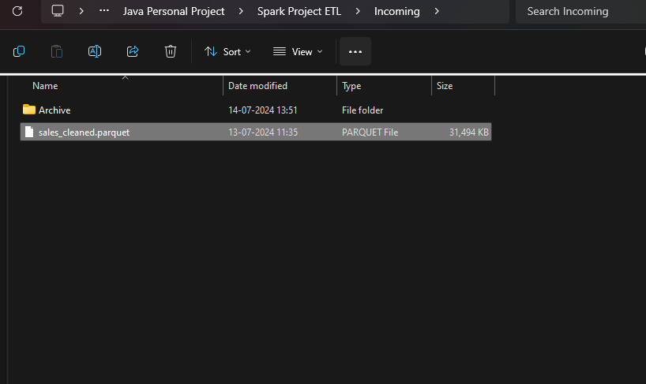
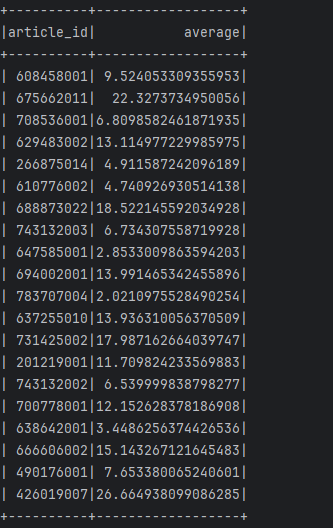
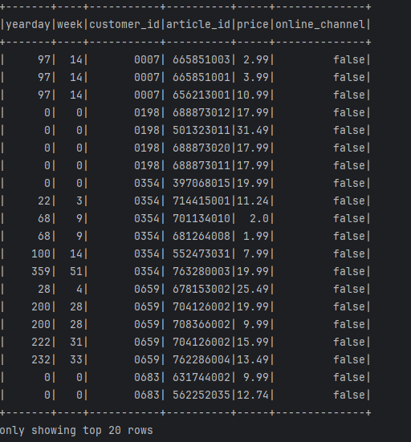
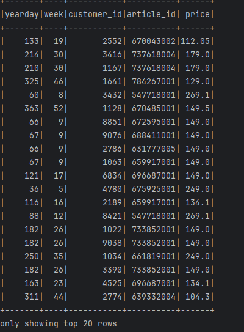
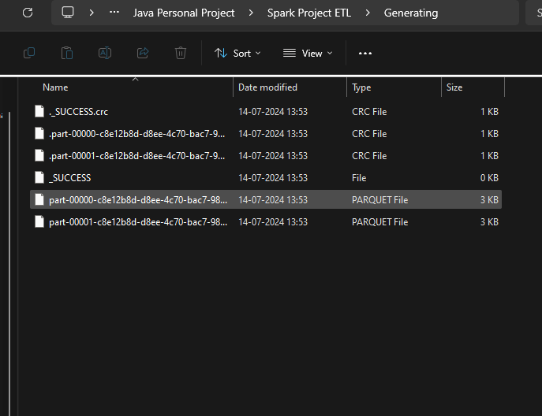
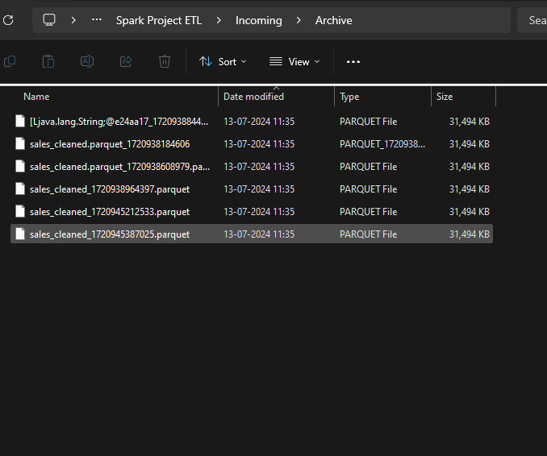

# SparkBasicETL
*Spark ETL project based on Java Spring Boot Project*.
A spring cron implementation which looks at the Incomming folder every 1 min and checks for a ***parquet file*** named "sales_cleaned.parquet". then it process the file and generate a ***DataSet***. Then transform the data, produce those transformed data into a generating folder.

---

### Tech Stack
1. Java, Spring-boot
2. Parquet File
3. Spark-Core, Spark-sql
4. Hadoop

---

### DataSet

kaegle: https://www.kaggle.com/datasets/tbierhance/hm-fashion-recommendation-parquet?resource=download&select=sales.parquet

H&M sales performance data. consists of many parquet file. In which I used sales.parquet file. this file has 31 million data of sales performance. In which I cleaned the data down to 5 milion data where sales are done in offline channel and yearday upto 366. And made the new data file as **sales_cleaned.parquet** file 

---

### Functionality

A spring cron was setup which would check a folder location which is configured in application.properties file. it will basically look for a file named "sales_cleaned.parquet" and extract its **Dataset** using **SparkSession**. then it will perform few transformation like calculating average sales per article_id then **writing**(Load) it into a new parquet file. Then padding 0's to the left of customer id upto 4 digits. then calculating max price per week and the customers that contributed in the max price. then writing to a new parquet file. Then once these operations are done, it will move the "sales_cleaned.parquet" to archive folder. 

> Incoming Folder

> Average Sales per article_id

> lpading customer_id 

> getting max price per week along with the customer_id who has paid that max price. 

> Generating parquet files. 

> Archive Folder

